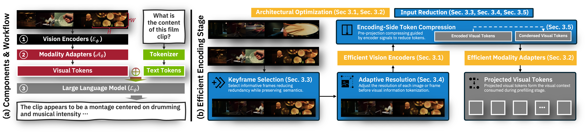
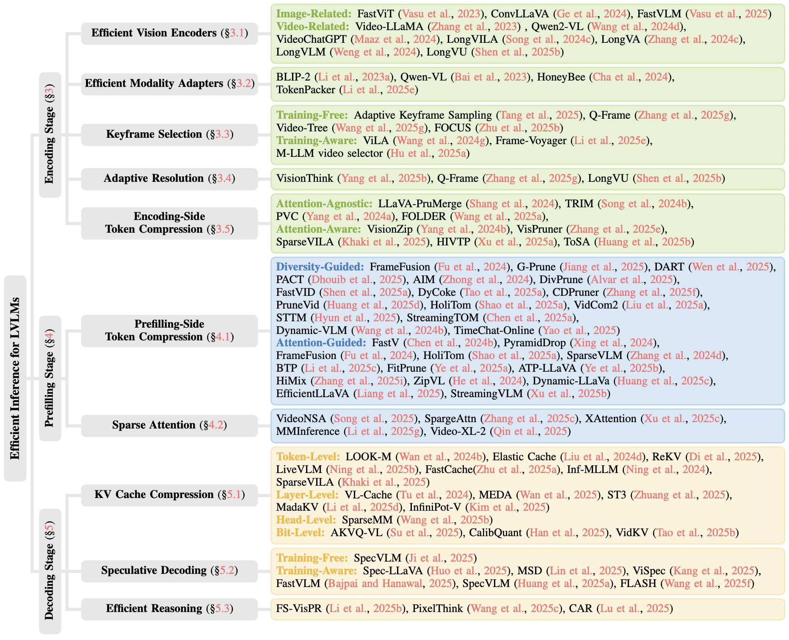

<div align="center">

# Awesome Efficient Inference for Large Vision-Language Models

**A stage-wise map of methods, benchmarks, and open-source resources for faster LVLM inference.**

[](https://awesome.re)
[](https://arxiv.org/abs/2604.05546)
[](https://sudis-zju.github.io/Efficient-LVLMs-Inference/)
[](CONTRIBUTING.md)
[](LICENSE.txt)

[**Survey**](https://arxiv.org/abs/2604.05546) ·
[**Research Hub**](https://sudis-zju.github.io/Efficient-LVLMs-Inference/) ·
[**Encoding**](#-encoding-stage) ·
[**Prefilling**](#-prefilling-stage) ·
[**Decoding**](#-decoding-stage) ·
[**Benchmarks**](#-benchmarks-and-datasets) ·
[**Contribute**](CONTRIBUTING.md)

</div>

> **September 2026 update** — Added recent work on adaptive visual-token pruning, hybrid KV-cache compression, attention reuse, multimodal speculative decoding, and dedicated efficiency benchmarks.

## At a Glance

| Stage | Main bottleneck | Representative directions | Jump |
|:---|:---|:---|:---:|
| **Encoding** | Vision-encoder FLOPs and redundant visual inputs | Efficient encoders, keyframes, adaptive resolution, encoding-side compression | [Browse](#-encoding-stage) |
| **Prefilling** | Long visual sequences and quadratic attention | Token compression and sparse attention | [Browse](#-prefilling-stage) |
| **Decoding** | KV-cache memory traffic and serial generation | KV compression, attention reuse, speculative decoding, efficient reasoning | [Browse](#-decoding-stage) |

<div align="center">
  
</div>

Large Vision-Language Models process high-resolution images, long videos, and multimodal contexts, making inference expensive in different ways at different stages. This repository organizes methods by **where redundancy is removed** in the inference lifecycle, so readers can move from a deployment bottleneck to the most relevant family of techniques.

## Taxonomy

<div align="center">
  
</div>

The taxonomy organizes representative methods by inference stage and optimization mechanism. Updated paper links, code resources, and concise contributions are maintained in the tables below.

## Browse the Collection

| Encoding | Prefilling | Decoding | Resources |
|:---|:---|:---|:---|
| [Vision Encoders](#efficient-vision-encoders) | [Token Compression](#token-compression) | [KV Cache Compression](#kv-cache-compression) | [Benchmarks](#-benchmarks-and-datasets) |
| [Modality Adapters](#efficient-modality-adapters) | [Sparse Attention](#sparse-attention) | [Attention Reuse](#attention-reuse) | [Related Surveys](#-survey-and-related-work) |
| [Keyframes](#keyframe-selection) |  | [Speculative Decoding](#speculative-decoding) | [Citation](#-citation) |
| [Adaptive Resolution](#adaptive-resolution) |  | [Efficient Reasoning](#efficient-reasoning) | [Contributing](#-contributing) |
| [Encoding-side Compression](#encoding-oriented-token-compression) |  |  |  |

> **Need faster lookup?** Use the [interactive Research Hub](https://sudis-zju.github.io/Efficient-LVLMs-Inference/) to search and filter the catalog, or download the machine-readable [JSON](docs/data/papers.json), [YAML](docs/data/papers.yaml), [CSV](docs/data/papers.csv), and [BibTeX](docs/data/papers.bib) exports.

### Reading Guide

- **Stage** indicates when an optimization acts: before the LLM, during context prefilling, or during autoregressive generation.
- **Training-free** methods can be applied without updating model parameters; **training-aware** methods learn a selector, compressor, or draft model.
- Methods spanning multiple stages are listed at their primary intervention point and cross-referenced when useful.

---

## 👁️ Encoding Stage

*Optimization techniques targeted at the encoding stage to reduce visual token count and encoding time.*

### Efficient Vision Encoders

#### Image-Related
| Paper | Venue | Code | Key Contribution |
|:---|:---:|:---:|:---|
| [**FastViT: A fast hybrid vision transformer using structural reparameterization**](https://doi.org/10.1109/ICCV51070.2023.00532) | ICCV 2023 | [](https://github.com/apple/ml-fastvit) | Novel token mixing operators and structural reparameterization |
| [**ConvLLaVA: Hierarchical backbones as visual encoder for large multimodal models**](https://arxiv.org/abs/2405.15738) | arXiv 2024 | [](https://github.com/alibaba/conv-llava) | Compresses high-resolution images into information-rich visual features |
| [**FastVLM: Efficient vision encoding for vision language models**](https://openaccess.thecvf.com/content/CVPR2025/html/Vasu_FastVLM_Efficient_Vision_Encoding_for_Vision_Language_Models_CVPR_2025_paper.html) | CVPR 2025 | [](https://machinelearning.apple.com/research/fastvlm-efficient-vision-encoding) | Hybrid vision encoder outputting fewer tokens and reducing encoding time |
| [**Glyph: Scaling Context Windows via Visual-Text Compression**](https://arxiv.org/abs/2510.17800) | arXiv 2025 | [](https://github.com/thu-coai/Glyph) | DeepEncoder maintaining low activations under high-resolution input |

#### Video-Related
| Paper | Venue | Code | Key Contribution |
|:---|:---:|:---:|:---|
| [**STC: Accelerating Streaming Video Large Language Models via Hierarchical Token Compression**](https://arxiv.org/abs/2512.00891) | CVPR 2026 | [](https://github.com/lern-to-write/STC) | Jointly accelerates ViT encoding through cross-frame feature caching and LLM prefilling through spatiotemporal token pruning |
| [**Qwen2-VL: Enhancing vision-language model's perception of the world at any resolution**](https://arxiv.org/abs/2409.12191) | arXiv 2024 | [](https://github.com/QwenLM/Qwen2-VL) | Native Dynamic Resolution framework enabling adaptive visual token generation |
| [**Video-ChatGPT: Towards detailed video understanding via large vision and language models**](https://doi.org/10.18653/v1/2024.acl-long.679) | ACL 2024 | [](https://github.com/mbzuai-oryx/Video-ChatGPT) | Applies pooling over visual tokens to obtain compact visual representations |
| [**MovieChat: From dense token to sparse memory for long video understanding**](https://doi.org/10.1109/CVPR52733.2024.01725) | CVPR 2024 | [](https://github.com/wenhaochai/MovieChat) | Vision encoder explicitly trained for long video scenarios |
| [**Long context transfer from language to vision**](https://arxiv.org/abs/2406.16852) | arXiv 2024 | - | Vision encoder explicitly trained for long video scenarios |
| [**LongVLM: Efficient long video understanding via large language models**](https://doi.org/10.1007/978-3-031-73414-4_26) | ECCV 2024 | [](https://github.com/ziplab/LongVLM) | Vision encoder explicitly trained for long video scenarios |
| [**LongVU: Spatiotemporal Adaptive Compression for Long Video-Language Understanding**](https://openreview.net/forum?id=XzZC4gs1mf) | ICML 2025 | [](https://vision-cair.github.io/LongVU/) | Preserves full features for query-relevant frames while applying spatial pooling |

### Efficient Modality Adapters

| Paper | Venue | Code | Key Contribution |
|:---|:---:|:---:|:---|
| [**BLIP-2: Bootstrapping Language-Image Pre-training**](https://proceedings.mlr.press/v202/li23q.html) | ICML 2023 | [](https://github.com/salesforce/LAVIS) | Bridges modality gap with lightweight Querying Transformer (Q-Former) |
| [**Video-LLaMA: An instruction-tuned audio-visual language model**](https://arxiv.org/abs/2306.02858) | arXiv 2023 | [](https://github.com/DAMO-NLP-SG/Video-LLaMA) | Proposes Video Q-Former for multi-modality video comprehension |
| [**Dynamic-VLM: Simple Dynamic Visual Token Compression for VideoLLM**](https://doi.org/10.48550/ARXIV.2412.09530) | arXiv 2024 | - | Dynamic visual token compression architecture adapting to different lengths |
| [**TokenPacker: Efficient Visual Projector for Multimodal LLM**](https://doi.org/10.1007/S11263-025-02491-7) | IJCV 2025 | - | Coarse-to-fine scheme injecting enriched characteristics |

### Keyframe Selection

#### Training-Free
| Paper | Venue | Code | Key Contribution |
|:---|:---:|:---:|:---|
| [**SeViLA: Self-chained image-language model for video localization**](http://papers.nips.cc/paper_files/paper/2023/hash/f22a9af8dbb348952b08bd58d4734b50-Abstract-Conference.html) | NeurIPS 2023 | [](https://github.com/Yui010206/SeViLA) | Uses frozen models as plug-and-play selectors for frame localization |
| [**KeyVideoLLM: Towards large-scale video keyframe selection**](https://arxiv.org/abs/2407.03104) | arXiv 2024 | - | Employs frozen models as plug-and-play selectors for keyframe localization |
| [**Q-Frame: Query-aware Frame Selection and Multi-Resolution Adaptation**](https://arxiv.org/abs/2506.22139) | arXiv 2025 | - | Text-image matching network with Gumbel-Max trick |
| [**VideoTree: Adaptive tree-based video representation**](https://openaccess.thecvf.com/content/CVPR2025/html/Wang_VideoTree_Adaptive_Tree-based_Video_Representation_for_LLM_Reasoning_on_Long_CVPR_2025_paper.html) | CVPR 2025 | - | Multi-granularity tree-based representation extracting query-relevant details |
| [**FOCUS: Efficient Keyframe Selection for Long Video Understanding**](https://arxiv.org/abs/2510.27280) | arXiv 2025 | - | Formulates keyframe selection as combinatorial pure-exploration |

#### Training-Aware
| Paper | Venue | Code | Key Contribution |
|:---|:---:|:---:|:---|
| [**VILA: Efficient video-language alignment for video question answering**](https://doi.org/10.1007/978-3-031-73033-7_11) | ECCV 2024 | - | Text-guided Frame-Prompter learning to extract question-related frames |
| [**Frame-Voyager: Learning to query frames for video LLMs**](https://arxiv.org/abs/2410.03226) | arXiv 2024 | - | Learns to query informative frame combinations |
| [**M-LLM based video frame selection for efficient video understanding**](https://openaccess.thecvf.com/content/CVPR2025/html/Hu_M-LLM_Based_Video_Frame_Selection_for_Efficient_Video_Understanding_CVPR_2025_paper.html) | CVPR 2025 | - | Uses spatial and temporal signals as supervision to train frame selector |

### Adaptive Resolution

| Paper | Venue | Code | Key Contribution |
|:---|:---:|:---:|:---|
| [**VisionThink: Smart and efficient vision language model via reinforcement learning**](https://doi.org/10.48550/arXiv.2507.13348) | arXiv 2025 | - | Dynamically processes distinct samples with different resolutions |
| [**ViCO: A Training Strategy towards Semantic Aware Dynamic High-Resolution**](https://arxiv.org/abs/2510.12793) | arXiv 2025 | - | Multiple MLP connectors with different compression ratios |
| [**Q-Frame: Query-aware Frame Selection and Multi-Resolution Adaptation**](https://arxiv.org/abs/2506.22139) | arXiv 2025 | - | Text-image matching network with Gumbel-Max trick |
| [**LongVU: Spatiotemporal Adaptive Compression**](https://openreview.net/forum?id=XzZC4gs1mf) | ICML 2025 | [](https://vision-cair.github.io/LongVU/) | Preserves full features for query-relevant frames |

### Encoding-Oriented Token Compression

#### Attention-Free
| Paper | Venue | Code | Key Contribution |
|:---|:---:|:---:|:---|
| [**EvoComp: Learning Visual Token Compression via Semantic-Guided Evolutionary Labeling**](https://arxiv.org/abs/2604.17087) | CVPR 2026 | - | Learns a lightweight visual token compressor from semantic-guided evolutionary token labels |
| [**LLaVA-PruMerge: Adaptive Token Reduction**](https://arxiv.org/abs/2403.15388) | ICCV 2025 | [](https://github.com/42Shawn/LLaVA-PruMerge) | Reduces visual tokens according to similarities between class and spatial tokens |
| [**PVC: Progressive Visual Token Compression**](https://arxiv.org/abs/2412.09613) | arXiv 2024 | - | Progressive compression strategy extending images as static videos |
| [**Less is More: A Simple yet Effective Token Reduction Method**](https://arxiv.org/abs/2409.10994) | arXiv 2024 | - | Token reduction using both CLIP metric and similarity (TRIM) |
| [**FOLDER: Accelerating Multi-modal Large Language Models**](https://arxiv.org/abs/2501.02430) | arXiv 2025 | - | Plug-and-play module in final vision backbone blocks for merging operations |
| [**Dynamic-VLM: Simple Dynamic Visual Token Compression**](https://doi.org/10.48550/ARXIV.2412.09530) | arXiv 2024 | - | Dynamic visual token compression architecture adapting to different lengths |
| [**Beyond Text-Visual Attention: Exploiting Visual Cues for Effective Token Pruning**](https://arxiv.org/abs/2412.01818) | arXiv 2025 | - | Selects informative tokens using visual attention (VisPruner) |

#### Attention-Aware
| Paper | Venue | Code | Key Contribution |
|:---|:---:|:---:|:---|
| [**Semantic-Guided Slow-Fast Pruning of Visual Tokens for Vision-Language Models**](https://ieeexplore.ieee.org/abstract/document/11460400) | ICASSP 2026 | - | Semantic-guided slow-fast pruning of visual tokens for VLMs |
| [**VisionZip: Longer is Better but Not Necessary**](https://arxiv.org/abs/2412.04467) | CVPR 2025 | [](https://github.com/dvlab-research/VisionZip) | Selects informative tokens using visual attention from encoder |
| [**HIVTP: Hierarchical Visual Token Pruning**](https://arxiv.org/abs/2509.23663) | arXiv 2025 | - | Attention maps from middle encoder layers to estimate visual token importance |
| [**ToSA: Token Merging with Spatial Awareness**](https://arxiv.org/abs/2506.20066) | arXiv 2025 | - | Token merging combining semantic and spatial awareness |
| [**SparseVILA: Decoupling Visual Sparsity for Efficient VLM Inference**](https://arxiv.org/abs/2510.17777) | ICCV 2025 | - | Estimates token importance from visual encoder's self-attention maps |

---

## ⚡ Prefilling Stage

*Techniques to reduce computational and memory overhead during the prefilling stage.*

### Token Compression

#### Diversity-Guided
| Paper | Venue | Code | Key Contribution |
|:---|:---:|:---:|:---|
| [**Unified Spatiotemporal Token Compression for Video-LLMs at Ultra-Low Retention**](https://arxiv.org/abs/2603.21957) | CVPR 2026 | - | Globally allocates a unified spatiotemporal token budget using contribution and redundancy signals |
| [**CoverPruner: Who Speaks for the Pruned? Visual Token Pruning as Coverage Optimization**](https://arxiv.org/abs/2609.03158) | arXiv 2026 | - | Formulates pruning as query-weighted representational coverage maximization |
| [**FrameFusion: Combining similarity and importance**](https://arxiv.org/abs/2501.01986) | arXiv 2024 | - | Merges tokens in shallow layers and prunes in deep layers |
| [**G-Prune: Training-free visual token pruning from graph perspective**](https://doi.org/10.1609/aaai.v39i4.32427) | AAAI 2025 | - | Similarity graph and information flow to retain representative tokens |
| [**DART: Stop looking for important tokens, duplication matters more**](https://arxiv.org/abs/2502.11494) | arXiv 2025 | - | Pivot-based duplication pruning selecting tokens with low duplication |
| [**AIM: Adaptive Inference of Multi-Modal LLMs**](https://doi.org/10.48550/ARXIV.2412.03248) | arXiv 2024 | - | Spatiotemporal token merging to reduce video redundancy |
| [**DivPrune: Diversity-based visual token pruning**](https://openaccess.thecvf.com/content/CVPR2025/html/Alvar_DivPrune_Diversity-based_Visual_Token_Pruning_for_Large_Multimodal_Models_CVPR_2025_paper.html) | CVPR 2025 | - | Max-Min diversity optimization for token subset selection |
| [**FastVID: Dynamic density pruning for fast video LLMs**](https://arxiv.org/abs/2503.11187) | arXiv 2025 | [](https://github.com/LunarShen/FastVID) | Temporal segmentation and density spatiotemporal pruning |
| [**DyCoke: Dynamic Compression of Tokens for Fast Video LLMs**](https://openaccess.thecvf.com/content/CVPR2025/html/Tao_DyCoke_Dynamic_Compression_of_Tokens_for_Fast_Video_Large_Language_CVPR_2025_paper.html) | CVPR 2025 | - | Plug-and-play temporal compression module minimizing temporal redundancy |
| [**CDPruner: Maximizing Conditional Diversity for Token Pruning**](https://arxiv.org/abs/2506.10967) | arXiv 2025 | - | Determinantal Point Processes (DPP) maximizing conditional diversity |
| [**PruneVid: Visual token pruning for efficient video LLMs**](https://aclanthology.org/2025.findings-acl.1024/) | ACL 2025 | - | Spatiotemporal token merging before LLMs |
| [**HoliTom: Holistic Token Merging for Fast Video LLMs**](https://arxiv.org/abs/2505.21334) | arXiv 2025 | - | Global redundancy-aware segmentation followed by spatiotemporal merging |
| [**VidCom2: Video Compression Commander**](https://arxiv.org/abs/2505.14454) | arXiv 2025 | - | Dynamic compression based on frame uniqueness |
| [**STTM: Multi-granular spatio-temporal token merging**](https://doi.org/10.48550/arXiv.2507.07990) | ICCV 2025 | - | Quadtree spatial transformation with directed pairwise merging |
| [**StreamingTOM: Streaming Token Compression**](https://arxiv.org/abs/2510.18269) | arXiv 2025 | - | Causal temporal reduction with fixed per-frame budget |
| [**Dynamic-VLM: Simple Dynamic Visual Token Compression**](https://doi.org/10.48550/ARXIV.2412.09530) | arXiv 2024 | - | Dynamic visual token compression architecture adapting to different lengths |
| [**TimeChat-Online: 80% Visual Tokens are Naturally Redundant**](https://doi.org/10.48550/ARXIV.2504.17343) | arXiv 2025 | - | Differential token drop module filtering redundant content in streaming videos |

#### Attention-Guided
| Paper | Venue | Code | Key Contribution |
|:---|:---:|:---:|:---|
| [**SwiftVLM: Efficient Vision-Language Model Inference via Cross-Layer Token Bypass**](https://arxiv.org/abs/2602.03134) | arXiv 2026 | - | Bypasses rather than permanently discards unselected tokens, enabling later-layer re-evaluation |
| [**ICCTP: Instruction-Guided Cross-Modal Clustering for Training-Free Visual Token Pruning**](https://doi.org/10.1609/aaai.v40i14.38212) | AAAI 2026 | - | Uses instruction noun anchors for cross-modal clustering and high-ratio token pruning |
| [**OccamToken: Efficient VLM Inference with Training-Free and Budget-Adaptive Token Pruning**](https://arxiv.org/abs/2605.29657) | arXiv 2026 | - | Uses register-anchored relative evidence tests for image- and query-adaptive pruning |
| [**SIEVE: When Vision Becomes Text**](https://arxiv.org/abs/2608.10489) | arXiv 2026 | - | Retains visual information unexplained by the text subspace using cross-modal residual guidance |
| [**AVTP: Multi-Image Visual Token Pruning in Large Visual Language Models**](https://arxiv.org/abs/2608.26806) | EMNLP Findings 2026 | [](https://github.com/zry13/AVTP) | Adaptively assigns token budgets across images and supports diverse VLM architectures |
| [**FastV: An image is worth 1/2 tokens after layer 2**](https://doi.org/10.1007/978-3-031-73004-7_2) | ECCV 2024 | [](https://github.com/pkunlp-icler/FastV) | Learns attention patterns in early layers to prune visual tokens in deeper layers |
| [**PyramidDrop: Accelerating via pyramid visual redundancy reduction**](https://arxiv.org/abs/2410.17247) | arXiv 2024 | [](https://github.com/Cooperx521/PyramidDrop) | Multi-stage pruning using attention score ranking |
| [**FrameFusion: Combining similarity and importance**](https://arxiv.org/abs/2501.01986) | arXiv 2024 | - | Merges tokens in shallow layers and prunes in deep layers |
| [**SparseVLM: Visual token sparsification for efficient inference**](https://arxiv.org/abs/2410.04417) | arXiv 2024 | - | Sparsifies visual tokens based on question prompt through text-visual attention scores |
| [**BTP: Balanced Token Pruning**](https://arxiv.org/abs/2505.22038) | arXiv 2025 | - | Multi-stage pruning with diversity and attention ranking objectives |
| [**Fit and Prune: Fast and training-free visual token pruning**](https://doi.org/10.1609/aaai.v39i21.34366) | AAAI 2025 | - | Minimizes divergence of attention distributions before and after pruning |
| [**ATP-LLaVA: Adaptive token pruning for LVLMs**](https://openaccess.thecvf.com/content/CVPR2025/html/Ye_ATP-LLaVA_Adaptive_Token_Pruning_for_Large_Vision_Language_Models_CVPR_2025_paper.html) | CVPR 2025 | - | Learnable adaptive token pruning module computing importance score |
| [**Video-XL-2: Towards Very Long-Video Understanding Through Task-Aware KV Sparsification**](https://arxiv.org/abs/2506.19225) | arXiv 2025 | - | Chunk-based attention with historical context for video processing |
| [**StreamingVLM: Real-time understanding for infinite video streams**](https://arxiv.org/abs/2510.09608) | arXiv 2025 | - | Maintains compact token subset by reusing attention sinks and recent token windows |

### Sparse Attention

| Paper | Venue | Code | Key Contribution |
|:---|:---:|:---:|:---|
| [**VideoNSA: Native Sparse Attention Scales Video Understanding**](https://arxiv.org/abs/2510.02295) | arXiv 2025 | - | End-to-end training with sparse attention preserving dense attention for text |
| [**SpargeAttn: Accurate sparse attention accelerating any model inference**](https://arxiv.org/abs/2502.18137) | arXiv 2025 | - | Two-stage online filter to skip unimportant regions in sparse attention |
| [**XAttention: Block sparse attention with antidiagonal scoring**](https://arxiv.org/abs/2503.16428) | arXiv 2025 | - | Block sparse attention with antidiagonal scoring for efficient block estimation |
| [**MMInference: Modality-Aware Permutation Sparse Attention**](https://arxiv.org/abs/2504.16083) | arXiv 2025 | - | Identifies three distinct attention patterns in LVLMs with modality-aware permutation |

---

## ⏩ Decoding Stage

*Optimization techniques for the autoregressive decoding stage.*

### KV Cache Compression

#### Token-Level
| Paper | Venue | Code | Key Contribution |
|:---|:---:|:---:|:---|
| [**DSTP: Why and When Visual Token Pruning Fails?**](https://arxiv.org/abs/2604.12358) | arXiv 2026 | - | Tracks decoding-stage relevant visual information shift to adapt token pruning during complex reasoning |
| [**LOOK-M: Look-once optimization in KV cache**](https://arxiv.org/abs/2406.18139) | arXiv 2024 | - | Text-prior compression policy prioritizing textual KVs while evicting visual tokens |
| [**Elastic Cache: Efficient inference of vision instruction-following models**](https://doi.org/10.1007/978-3-031-72643-9_4) | ECCV 2024 | - | Cache merging strategy fusing less important KVs guided by distinct metrics |
| [**ReKV: Streaming video QA with in-context video KV-cache retrieval**](https://arxiv.org/abs/2503.00540) | arXiv 2025 | - | Retrieval-based framework offloading video chunks to external memory |
| [**LiveVLM: Efficient Online Video Understanding via Streaming-Oriented KV Cache**](https://arxiv.org/abs/2505.15269) | arXiv 2025 | - | Dual-memory approach with short-term sliding window and compressed long-term memory |
| [**FastCache: Optimizing multimodal LLM serving**](https://arxiv.org/abs/2503.08461) | arXiv 2025 | - | Lightweight modality-specific compressor learning compression patterns |

#### Layer-Level
| Paper | Venue | Code | Key Contribution |
|:---|:---:|:---:|:---|
| [**AirCache: Activating Inter-modal Relevancy KV Cache Compression**](https://arxiv.org/abs/2503.23956) | arXiv 2025 | - | Models stable inter-modal relevance and adaptively allocates visual KV budgets across layers |
| [**VL-Cache: Sparsity and modality-aware KV cache compression**](https://arxiv.org/abs/2410.23317) | arXiv 2024 | - | Dynamically sets each layer's cache size according to measured attention sparsity |
| [**Meda: Dynamic KV cache allocation for efficient multimodal inference**](https://arxiv.org/abs/2502.17599) | arXiv 2025 | - | Cross-modal attention entropy guiding cache allocation to layers with complex interactions |
| [**ST3: Accelerating MLLM by spatial-temporal visual token trimming**](https://doi.org/10.1609/aaai.v39i10.33201) | AAAI 2025 | - | Progressive pruning of visual tokens in deeper layers based on decreasing visual importance |
| [**MadaKV: Adaptive Modality-Perception KV Cache Eviction**](https://aclanthology.org/2025.acl-long.652/) | ACL 2025 | - | Inter-layer compensation mechanism dynamically adjusting budgets |
| [**InfiniPot-V: Memory-Constrained KV Cache Compression**](https://arxiv.org/abs/2506.15745) | arXiv 2025 | - | Layer-wise adaptive pooling with varying kernel sizes to balance abstraction and detail |

#### Head-Level
| Paper | Venue | Code | Key Contribution |
|:---|:---:|:---:|:---|
| [**HybridKV: Hybrid KV Cache Compression for Efficient Multimodal Large Language Model Inference**](https://arxiv.org/abs/2604.05887) | ACL 2026 | - | Classifies attention heads as static or dynamic and applies head-specific pruning or chunk retrieval |
| [**SparseMM: Head Sparsity Emerges from Visual Concept Responses**](https://arxiv.org/abs/2506.05344) | arXiv 2025 | - | Identifies vital visual heads and allocates asymmetric budgets based on visual relevance |

#### Bit-Level
| Paper | Venue | Code | Key Contribution |
|:---|:---:|:---:|:---|
| [**AKVQ-VL: Attention-Aware KV Cache Adaptive 2-Bit Quantization**](https://arxiv.org/abs/2501.15021) | arXiv 2025 | - | Adaptive mixed-precision quantization with high bit-width for critical tokens and 2-bit for others |
| [**CalibQuant: 1-Bit KV Cache Quantization for Multimodal LLMs**](https://arxiv.org/abs/2502.14882) | arXiv 2025 | - | Channel-wise 1-bit quantization with post-calibration for extreme values |
| [**VidKV: Plug-and-Play 1.x-Bit KV Cache Quantization**](https://arxiv.org/abs/2503.16257) | arXiv 2025 | - | Sub-2-bit quantization with differential treatment for K and V |

### Attention Reuse

| Paper | Venue | Code | Key Contribution |
|:---|:---:|:---:|:---|
| [**Q Cache: Visual Attention is Valuable in Less than Half of Decode Layers for Multimodal Large Language Model**](https://arxiv.org/abs/2602.01901) | arXiv 2026 | - | Reuses similar attention queries across adjacent layers through a lightweight layer-shared cache |

### Speculative Decoding

#### Training-Free
| Paper | Venue | Code | Key Contribution |
|:---|:---:|:---:|:---|
| [**MMSpec: Benchmarking Speculative Decoding for Vision-Language Models**](https://arxiv.org/abs/2603.14989) | arXiv 2026 | [](https://mmspec-bench.github.io/) | Benchmarks ten speculative decoding methods and introduces vision-adaptive ViSkip |
| [**SpecVLM: Enhancing speculative decoding via verifier-guided token pruning**](https://doi.org/10.48550/arXiv.2508.16201) | EMNLP 2025 | - | Verifier-guided staged pruning removing up to 90% of vision tokens from draft model input |

#### Training-Aware
| Paper | Venue | Code | Key Contribution |
|:---|:---:|:---:|:---|
| [**MASSV: Multimodal Adaptation and Self-Data Distillation for Speculative Decoding of VLMs**](https://arxiv.org/abs/2505.10526) | arXiv 2025 | - | Converts small language models into multimodal drafters using a vision projector and self-distillation |
| [**Spec-LLaVA: Accelerating VLMs with Dynamic Tree-Based Speculative Decoding**](https://arxiv.org/abs/2509.11961) | arXiv 2025 | - | Compact distilled draft model paired with tree-based verification algorithm |
| [**MSD: Speculative Decoding Reimagined for Multimodal Large Language Models**](https://arxiv.org/abs/2505.14260) | arXiv 2025 | - | Two-stage training enabling draft model to acquire language modeling and visual perception |
| [**ViSpec: Accelerating VLMs with Vision-Aware Speculative Decoding**](https://arxiv.org/abs/2509.15235) | arXiv 2025 | - | Lightweight vision adaptor to compress image tokens for draft model |
| [**FastVLM: Self-Speculative Decoding for Fast Vision-Language Model Inference**](https://arxiv.org/abs/2510.22641) | arXiv 2025 | - | Imitation-based draft model learning from deeper representations (self-speculative decoding) |
| [**Glyph: Scaling Context Windows via Visual-Text Compression**](https://arxiv.org/abs/2510.17800) | arXiv 2025 | [](https://github.com/thu-coai/Glyph) | Introduces DeepEncoder maintaining low activations under high-resolution input |
| [**SpecVLM: Fast Speculative Decoding in Vision-Language Models**](https://arxiv.org/abs/2509.11815) | arXiv 2025 | - | Elastic visual compressor adaptively selecting from multiple compression primitives |
| [**FLASH: Latent-Aware Semi-Autoregressive Speculative Decoding**](https://arxiv.org/abs/2505.12728) | arXiv 2025 | - | Visual token compression mechanism and semi-autoregressive head for draft model optimization |

### Efficient Reasoning

| Paper | Venue | Code | Key Contribution |
|:---|:---:|:---:|:---|
| [**Adaptive Fast-and-Slow Visual Program Reasoning for Long-Form VideoQA**](https://arxiv.org/abs/2509.17743) | arXiv 2025 | - | Fast-slow reasoning framework routing simple queries to VideoLLM and complex ones to visual program workflow |
| [**PixelThink: Towards Efficient Chain-of-Pixel Reasoning**](https://arxiv.org/abs/2505.23727) | arXiv 2025 | - | Reinforcement learning to regulate reasoning chain length based on task difficulty and model confidence |
| [**Prolonged reasoning is not all you need: Certainty-based adaptive routing**](https://arxiv.org/abs/2505.15154) | arXiv 2025 | - | Certainty-based routing triggering long thought chains only when initial answer exhibits high uncertainty |

---

## 📊 Benchmarks and Datasets

### Multimodal Understanding Benchmarks

| Benchmark | Description | Resources |
|:---|:---|:---:|
| **MME** | Comprehensive evaluation for multimodal LLMs | [[Paper]](https://arxiv.org/abs/2306.13394) [[Leaderboard]](https://github.com/BradyFU/Awesome-Multimodal-Large-Language-Models/tree/Evaluation) |
| **SEED-Bench** | Benchmarking multimodal LLMs | [[Paper]](https://arxiv.org/abs/2307.16125) [[Code]](https://github.com/AILab-CVC/SEED-Bench) |
| **MMMU** | Massive multi-discipline multimodal understanding | [[Paper]](https://arxiv.org/abs/2311.16502) [[Website]](https://mmmu-benchmark.github.io/) |

### Video Understanding Benchmarks

| Benchmark | Description | Resources |
|:---|:---|:---:|
| **Video-MME** | First comprehensive video analysis benchmark | [[Paper]](https://arxiv.org/abs/2405.21075) [[Website]](https://video-mme.github.io/) |
| **LongVideoBench** | Long-context interleaved video-language understanding | [[Paper]](https://arxiv.org/abs/2407.15754) [[Code]](https://github.com/longvideobench/LongVideoBench) |
| **MVBench** | Comprehensive multi-modal video understanding | [[Paper]](https://arxiv.org/abs/2311.17005) [[Code]](https://github.com/OpenGVLab/Ask-Anything) |

### Efficient Inference Benchmarks

| Benchmark | Description | Resources |
|:---|:---|:---:|
| **VTC-Bench** | Compression-sensitive evaluation framework that denoises existing benchmarks using image downsampling | [[Paper]](https://aclanthology.org/2026.acl-long.195/) |
| **MMSpec** | Unified benchmark of ten speculative decoding algorithms across six multimodal task categories | [[Paper]](https://arxiv.org/abs/2603.14989) [[Website]](https://mmspec-bench.github.io/) |

---

## 📚 Survey and Related Work

### Related Surveys

| Survey | Description | Year |
|:---|:---|:---:|
| **Token Compression Survey** | Survey on token compression in LLMs | 2025 | [[Paper]](https://arxiv.org/abs/2501.05787) |
| **Efficient LLMs Survey** | Comprehensive survey on efficient LLMs | 2024 | [[Paper]](https://arxiv.org/abs/2312.03863) |
| **MLLM Survey** | Survey on multimodal LLMs | 2024 | [[Paper]](https://arxiv.org/abs/2306.13549) |

---

## 📝 Citation

This repository accompanies our survey, **Efficient Inference for Large Vision-Language Models: Bottlenecks, Techniques, and Prospects**.

<details>
<summary><b>Authors and affiliations</b></summary>

Jun Zhang*, Yicheng Ji*, Feiyang Ren*, Yihang Li*, Bowen Zeng*, Zonghao Chen*, Ke Chen, Lidan Shou, Gang Chen, and Huan Li (* equal contribution).

1. The State Key Laboratory of Blockchain and Data Security, Zhejiang University<br>
2. Hangzhou High-Tech Zone (Binjiang) Institute of Blockchain and Data Security

</details>

If you find the survey or repository useful, please consider citing:

```bibtex
@misc{zhang2026efficientinferencelargevisionlanguage,
      title={Efficient Inference for Large Vision-Language Models: Bottlenecks, Techniques, and Prospects}, 
      author={Jun Zhang and Yicheng Ji and Feiyang Ren and Yihang Li and Bowen Zeng and Zonghao Chen and Ke Chen and Lidan Shou and Gang Chen and Huan Li},
      year={2026},
      eprint={2604.05546},
      archivePrefix={arXiv},
      primaryClass={cs.CL},
      url={https://arxiv.org/abs/2604.05546}, 
}

```

---

## 🤝 Contributing

We welcome contributions! If you find a relevant paper or resource, use the [paper submission form](https://github.com/SuDIS-ZJU/Efficient-LVLMs-Inference/issues/new?template=add-paper.yml) or:

1. Fork this repository
2. Add the paper to the appropriate category
3. Submit a pull request

For inclusion criteria and formatting conventions, see [CONTRIBUTING.md](CONTRIBUTING.md).

---

**Disclaimer**: This is a living document and will be continuously updated. If you notice any missing papers or have suggestions for better categorization, feel free to open an issue or submit a pull request.

*Last Updated: 2026-09-21*
